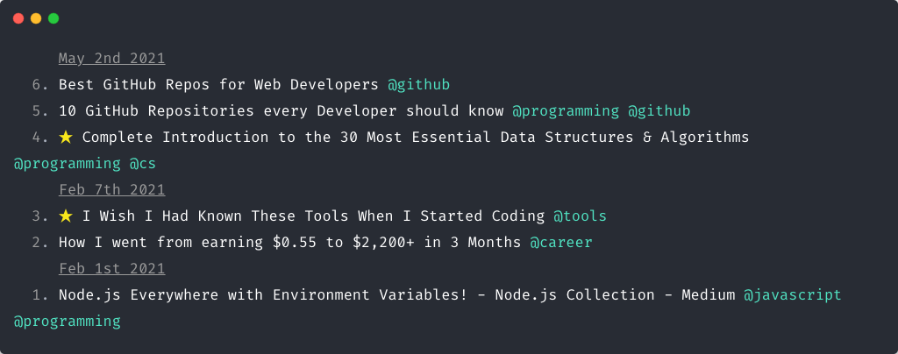

<h1 align="center">
  Paperboard
</h1>

<h4 align="center">
  Paperboard, is a cli application for managing a reading list of bookmarks from the Internet.
</h4>

<div align="center">
  
</div>

<h4 align="center">
  Paperboard, is under development. You may encounter bugs or there will be breaking changes. 
</h4>


## Install

### Yarn

```bash
yarn global add paperboard
```

### NPM

```bash
npm install --global paperboard
```

## Usage

```
$ paperboard --help
Usage: paperboard [options] [command]

Options:
  -h, --help                       display help for command

Commands:
  list [options]                   display bookmarks
  show <id>                        display a bookmark
  add <url> [tags...]              add new bookmark
  delete <id>                      delete bookmark
  star <id>                        star/unstar bookmark
  archive <id>                     archive/restore bookmark
  set-tags|set-tag <id> [tags...]  set bookmark tags
  open <id>                        open bookmark url in browser
  read <id>                        read bookmark offline
  run                              run paperboard web application
  help [command]                   display help for command
```

## Highlights
- Simple and minimal web interface
- Organize bookmarks, add, edit, delete and search
- Archive and restore bookmarks
- Star & unstar mechanisms
- Simple and minimal command line interface
- Uses sqlite3 as its database
- Reading bookmarks offlane
- Make bookmarks more readable by removing extra stuffs

## Development

Any contribution, pull requests, issue and feedbacks would be greatly appreciated.

- Fork the repository and clone it to your machine
- Navigate to your local fork: `cd paperboard`
- Install the project dependencies: `npm install` or `yarn install`

## License

[MIT](https://github.com/majidsajadi/paperboard/blob/master/license)
